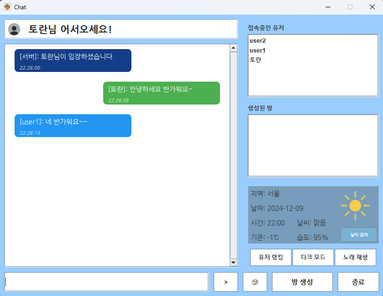
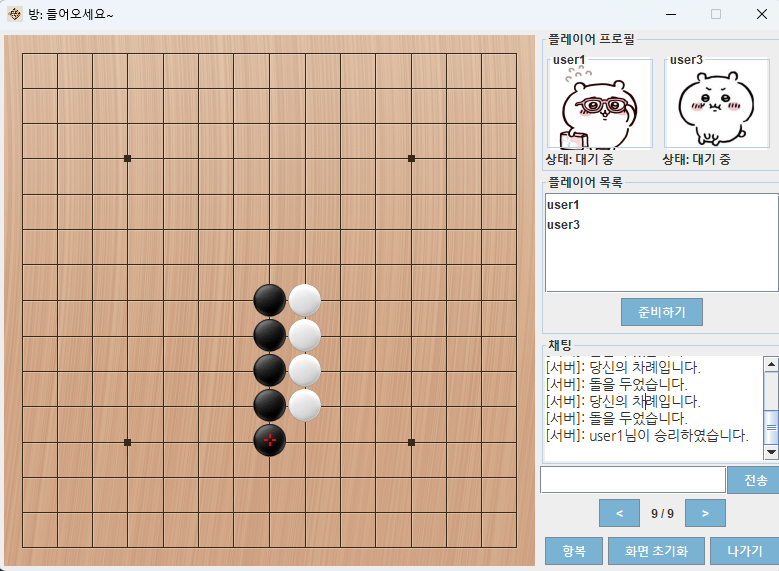
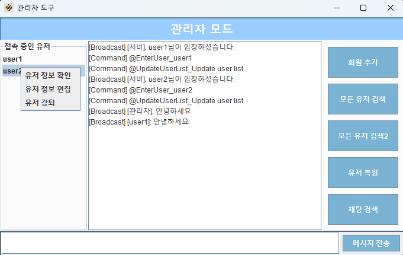
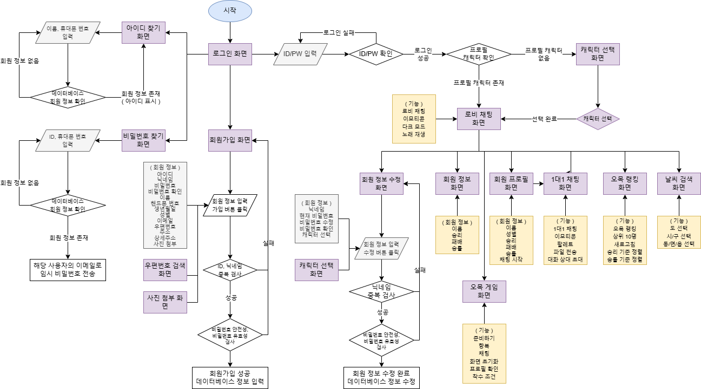
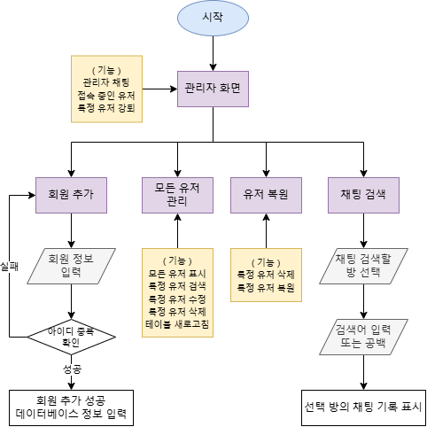

# 자바 소켓 통신 오목 게임 프로젝트

## 프로젝트 개요

Java Swing과 소켓 통신을 활용하여 개발된 멀티플레이어 오목 게임입니다. 실시간 채팅, 1대1 채팅, 파일 전송, 사용자 관리 등 다양한 기능을 제공하는 종합적인 게임 플랫폼입니다.

### 프로젝트 화면 미리보기

#### 로비 화면


*사용자들이 채팅하고 오목 게임에 참여할 수 있는 메인 로비 화면*

#### 게임 화면


*실시간 멀티플레이어 오목 게임 화면 - 15x15 오목판과 채팅 기능*

#### 관리자 도구 화면


*서버 관리자가 사용자와 채팅을 모니터링할 수 있는 관리자 도구*

#### 클라이언트 화면 플로우차트


*클라이언트 애플리케이션의 화면 전환 흐름도*

#### 관리자 도구 플로우차트


*관리자 도구의 기능 및 사용 흐름도*

## 주요 기능

### 게임 기능
- **실시간 멀티플레이어 오목 게임**
  - 15x15 오목판에서 5개 연속 돌 놓기 게임
  - 실시간 게임 상태 동기화
  - 관전자 모드 지원
  - 게임 준비/시작 시스템
  - 항복 기능

  
  
  *실시간 멀티플레이어 오목 게임 - 15x15 오목판과 실시간 채팅 기능*

### 채팅 시스템
- **다중 채팅방 지원**
  - 그룹 채팅방 생성/입장/퇴장
  - 실시간 메시지 전송
  - 귓속말 기능
  - 이모지 전송
  - 메시지 검색 기능

- **1대1 채팅**
  - 개인 채팅방 생성
  - 파일 전송/다운로드
  - 채팅 기록 저장

  
  
  *채팅 로비 화면 - 사용자 목록, 채팅방 목록, 오목 방 목록을 한눈에 확인*

### 사용자 관리
- **회원가입/로그인 시스템**
  - MySQL 데이터베이스 연동
  - 아이디/닉네임 중복 확인
  - 비밀번호 암호화
  - 프로필 캐릭터 선택

- **사용자 정보 관리**
  - 개인정보 수정
  - 프로필 사진 업로드
  - 게임 전적 관리 (승/패 기록)
  - 랭킹 시스템

### 관리자 기능
- **관리자 도구**
  - 사용자 목록 관리
  - 사용자 강퇴 기능
  - 채팅 로그 모니터링
  - 실시간 서버 상태 확인

  
  
  *관리자 도구 - 서버 상태 모니터링 및 사용자 관리 기능*

## 프로젝트 구조

```
src/
├── ChatApp/                    # 채팅 애플리케이션
│   ├── Client/                # 클라이언트
│   │   ├── ChatLobbyLayout/   # 채팅 로비 UI
│   │   ├── GroupChatLayout/   # 그룹 채팅 UI
│   │   ├── PrivateChatRoom/   # 1대1 채팅 UI
│   │   ├── OmokRankingLayout/ # 오목 랭킹 UI
│   │   └── UserProfileEditLayout/ # 프로필 편집 UI
│   └── Server/                # 서버
│       ├── AdminToolUI/       # 관리자 도구
│       └── ServerInfo/        # 서버 정보 관리
├── Database/                  # 데이터베이스 관련
│   ├── Design/               # UI 디자인 컴포넌트
│   ├── FindFrame/            # 아이디/비밀번호 찾기
│   ├── UserInfo/             # 사용자 정보 관리
│   └── ZipcodeSearch/        # 우편번호 검색
├── Function/                 # 공통 기능
│   ├── DTO/                  # 데이터 전송 객체
│   ├── EmotionDisplay/       # 이모지 표시
│   ├── ImageResize/          # 이미지 리사이징
│   ├── Music/                # 배경음악
│   ├── ProfileCharacterSelector/ # 캐릭터 선택
│   ├── SwingCompFunc/        # Swing 컴포넌트 기능
│   └── WeatherSearch/        # 날씨 검색
├── OmokGame/                 # 오목 게임
│   └── Panel/                # 게임 패널
├── Data/                     # 공통 데이터
│   ├── Listener/             # 이벤트 리스너
│   └── OmokImage/            # 오목 게임 이미지
└── TestPack/                 # 테스트 코드
```

## 기술 스택

- **언어**: Java 8+
- **GUI**: Java Swing
- **네트워크**: Java Socket Programming (TCP/IP)
- **데이터베이스**: MySQL 8.0
- **직렬화**: Java Serialization
- **외부 라이브러리**:
  - **MySQL Connector/J 9.0.0** - MySQL 데이터베이스 연결
  - **Gson 2.11.0** - JSON 데이터 처리
  - **Jakarta Mail 1.6.7** - 이메일 전송 기능
  - **Jakarta Activation 1.2.2** - Jakarta Activation API
  - **JavaBeans Activation Framework 1.1.1** - 이메일 첨부파일 처리
  - **JavaMail API 1.4.7** - 이메일 전송 (레거시 지원)

## 설치 및 실행

### 1. 사전 요구사항
- Java 8 이상
- MySQL 8.0 이상
- IntelliJ IDEA 또는 Eclipse

### 2. 데이터베이스 설정
```sql
-- 데이터베이스 생성
CREATE DATABASE Omok;

-- 사용자 테이블 생성
-- CreateUserTable.sql 실행

-- 채팅 로그 테이블 생성
-- CreateChatTable.sql 실행

-- 오목 게임 테이블 생성
-- CreateOmokTable.sql 실행
```

### 3. 프로젝트 설정

#### 3.1 프로젝트 클론 및 IDE 설정
1. 프로젝트를 로컬에 클론
2. IntelliJ IDEA 또는 Eclipse에서 프로젝트 열기

#### 3.2 라이브러리 설정 (JAR 파일 추가)

프로젝트 루트 디렉토리에 있는 다음 JAR 파일들을 라이브러리로 추가해야 합니다:

**필수 라이브러리:**
- `mysql-connector-j-9.0.0.jar` - MySQL 데이터베이스 연결
- `gson-2.11.0.jar` - JSON 데이터 처리

**이메일 기능용 라이브러리:**
- `jakarta.mail-1.6.7.jar` - 이메일 전송 기능
- `jakarta.activation-1.2.2.jar` - Jakarta Activation API
- `activation-1.1.1.jar` - JavaBeans Activation Framework
- `mail-1.4.7.jar` - JavaMail API (레거시)

#### 3.3 IntelliJ IDEA에서 라이브러리 추가 방법

1. **File → Project Structure** (Ctrl+Alt+Shift+S) 열기
2. **Libraries** 탭 선택
3. **+** 버튼 클릭 → **Java** 선택
4. 프로젝트 루트의 JAR 파일들을 선택하여 추가:
   ```
   mysql-connector-j-9.0.0.jar
   gson-2.11.0.jar
   jakarta.mail-1.6.7.jar
   jakarta.activation-1.2.2.jar
   activation-1.1.1.jar
   mail-1.4.7.jar
   ```
5. **Apply** → **OK** 클릭

#### 3.4 Eclipse에서 라이브러리 추가 방법

1. 프로젝트 우클릭 → **Properties**
2. **Java Build Path** → **Libraries** 탭 선택
3. **Add External JARs** 클릭
4. 프로젝트 루트의 JAR 파일들을 선택하여 추가
5. **Apply and Close** 클릭

#### 3.5 설정 파일 구성

프로젝트 루트에 `config.properties` 파일을 생성하고 다음 내용을 설정:

```properties
# 날씨 API 설정
weather.api.url=https://apis.data.go.kr/1360000/VilageFcstInfoService_2.0/getUltraSrtFcst
weather.api.key=YOUR_WEATHER_API_KEY_HERE

# 데이터베이스 설정
db.url=jdbc:mysql://localhost:3307/Omok?useUnicode=true&characterEncoding=UTF-8
db.user=root
db.password=YOUR_DB_PASSWORD_HERE

# 서버 설정
server.port=7777

# 이메일 설정 (SMTP)
email.smtp.host=smtp.gmail.com
email.smtp.port=587
email.sender.address=YOUR_EMAIL_HERE
email.sender.password=YOUR_APP_PASSWORD_HERE

# 우편번호 API 설정
postal.api.key=YOUR_POSTAL_API_KEY_HERE
postal.api.url=http://openapi.epost.go.kr/postal/retrieveNewAdressAreaCdSearchAllService/retrieveNewAdressAreaCdSearchAllService/getNewAddressListAreaCdSearchAll
```

#### 3.6 API 키 신청 방법

프로젝트에는 여러 외부 API가 포함되어 있습니다.

**1. 날씨 API (기상청 공공데이터포털)**
- **API 신청**: [기상청 공공데이터포털](https://data.go.kr/tcs/dss/selectApiDataDetailView.do?publicDataPk=15084084)
- **신청 절차**:
  - 공공데이터포털 회원가입
  - "초단기예보 조회서비스" 신청
  - 승인 후 API 키 발급
- **API 키 설정**: `config.properties` 파일의 `weather.api.key`에 발급받은 키 입력

**2. 우편번호 API (우체국)**
- **API 신청**: [우체국 우편번호 API](https://www.epost.go.kr/search/zipcode/zipcodeApi.jsp)
- **신청 절차**:
  - 우체국 API 사이트 회원가입
  - 우편번호 검색 API 신청
  - 승인 후 API 키 발급
- **API 키 설정**: `config.properties` 파일의 `postal.api.key`에 발급받은 키 입력

**3. Gmail SMTP 설정**
- **Gmail 계정 설정**:
  - Gmail 계정에서 2단계 인증 활성화
  - [앱 비밀번호 생성](https://myaccount.google.com/apppasswords)
- **설정 방법**:
  - 생성된 앱 비밀번호를 `email.sender.password`에 입력
  - Gmail 주소를 `email.sender.address`에 입력

**API 정보:**
- **날씨 API**: 기온, 습도, 강수형태, 하늘상태 등 (XML 형식)
- **우편번호 API**: 도로명주소, 지번주소, 우편번호 검색 (XML 형식)
- **SMTP**: Gmail을 통한 이메일 전송 (비밀번호 찾기 기능)

#### 3.7 데이터베이스 연결 설정

`config.properties` 파일에서 데이터베이스 연결 정보를 수정:

**주의사항:**
- MySQL 포트가 3306이 아닌 3307로 설정되어 있음
- 데이터베이스 이름: `Omok`
- 문자 인코딩: UTF-8
- `config.properties` 파일은 Git에 업로드되지 않음 (보안)

### 4. 실행 방법

#### 4.1 서버 실행
1. **IntelliJ IDEA**: `src/ChatApp/Server/Main.java` 파일을 열고 실행
2. **Eclipse**: `src/ChatApp/Server/Main.java` 파일을 우클릭 → Run As → Java Application
3. **명령줄**: 
   ```bash
   javac -cp ".:mysql-connector-j-9.0.0.jar:gson-2.11.0.jar:jakarta.mail-1.6.7.jar:jakarta.activation-1.2.2.jar:activation-1.1.1.jar:mail-1.4.7.jar" src/ChatApp/Server/*.java
   java -cp ".:mysql-connector-j-9.0.0.jar:gson-2.11.0.jar:jakarta.mail-1.6.7.jar:jakarta.activation-1.2.2.jar:activation-1.1.1.jar:mail-1.4.7.jar:src" ChatApp.Server.Main
   ```
4. 서버가 정상적으로 시작되면 콘솔에 "서버가 시작되었습니다. IP: [IP주소], Port: [7777]" 메시지가 출력됩니다.

#### 4.2 클라이언트 실행
1. **로그인 화면 실행**:
   - `src/Database/MainApp.java` 실행 (회원가입/로그인)
   
2. **직접 클라이언트 실행** (로그인 생략):
   - `src/ChatApp/Client/ClientApplication.java` 실행

#### 4.3 오목 게임 단독 실행 (테스트용)
- `src/OmokGame/Main.java` 실행
- 네트워크 연결 없이 게임 UI만 테스트 가능

#### 4.4 실행 순서
1. **MySQL 서버 시작**
2. **서버 애플리케이션 실행** (`ChatApp.Server.Main`)
3. **클라이언트 애플리케이션 실행** (`Database.MainApp`)
4. **로그인 후 채팅 로비에서 오목 게임 시작**

#### 4.5 실행 흐름도


*애플리케이션 실행부터 게임 시작까지의 전체 흐름*


*관리자 도구 사용 흐름도*

#### 4.6 포트 설정
- **서버 포트**: 7777 (기본값)
- **MySQL 포트**: 3307 (기본값 3306이 아님)
- 포트 변경이 필요한 경우 `src/ChatApp/Server/ServerInfo/ServerInfo.java`에서 수정

## 핵심 클래스 설명

### 서버 측
- **`ServerApplication`**: 메인 서버 클래스, 클라이언트 연결 관리
- **`ReceiveThread`**: 각 클라이언트별 통신 스레드
- **`OmokRoom`**: 오목 게임방 정보 관리
- **`Database`**: MySQL 데이터베이스 연동

### 클라이언트 측
- **`ClientApplication`**: 클라이언트 메인 클래스, 서버와 통신
- **`GameFrame`**: 오목 게임 메인 프레임
- **`BoardCanvas`**: 오목판 그리기 및 이벤트 처리
- **`ChatLobbyLayout`**: 채팅 로비 UI

### 공통
- **`MessageDTO`**: 클라이언트-서버 간 메시지 전송 객체
- **`MessageType`**: 메시지 타입 열거형
- **`Data`**: 게임 상태 공유 데이터

## 주요 기능 구현

### 소켓 통신
- TCP 소켓을 이용한 실시간 양방향 통신
- ObjectInputStream/ObjectOutputStream을 통한 객체 직렬화
- 멀티스레드 환경에서의 안전한 통신

### 오목 게임 로직
- 15x15 바둑판에서 5개 연속 돌 놓기 승리 조건
- 4방향(수평, 수직, 대각선) 승리 검사 알고리즘
- 실시간 게임 상태 동기화

### 데이터베이스 연동
- 사용자 정보, 채팅 로그, 게임 전적 저장
- PreparedStatement를 이용한 SQL 인젝션 방지
- 트랜잭션 처리

## UI/UX 특징

- **직관적인 사용자 인터페이스**
- **실시간 상태 업데이트**
- **다양한 이모지 및 캐릭터 지원**
- **반응형 레이아웃**

## 데이터베이스 스키마

### users 테이블
- 사용자 기본 정보 (아이디, 닉네임, 비밀번호 등)
- 프로필 정보 (사진, 캐릭터 번호)
- 게임 전적 (승/패 기록)

### chat_logs 테이블
- 채팅 메시지 저장
- 방별 메시지 분류
- 타임스탬프 기록

### omok_moves 테이블
- 오목 게임 수순 저장
- 플레이어별 좌표 기록
- 게임 분석용 데이터

## 향후 개선하면 좋을 부분

- [ ] 웹 기반 UI로 전환
- [ ] REST API 서버 구축
- [ ] 실시간 알림 시스템
- [ ] 모바일 앱 개발
- [ ] AI 상대 기능 추가
- [ ] 토너먼트 시스템